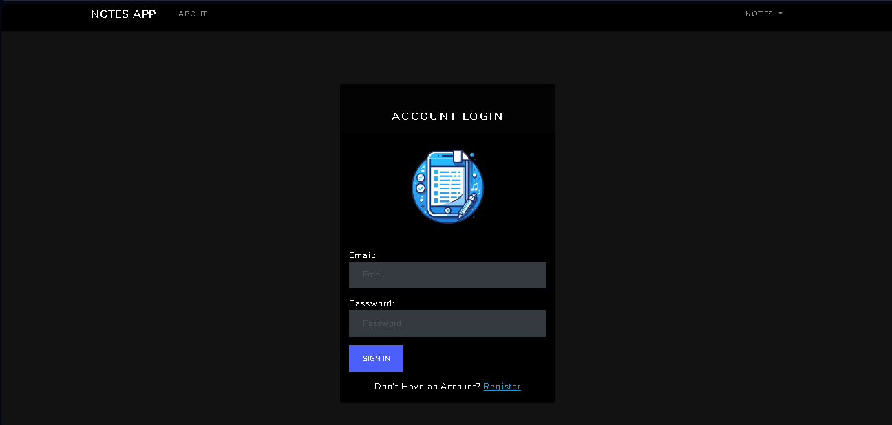

# Notes App

---

This is a basic web application designed to manage simple notes using JavaScript technologies such as Node.js, MongoDB, and other related technologies. Technically, this is a multi-page application utilizing Handlebars as the template engine.



## Features

- **CRUD Operations:** Users can perform Create, Read, Update, and Delete operations on notes.
- **User Authentication:** Users can log in and save their personal notes securely.

## Technologies Used

- **Node.js:** Server-side JavaScript runtime environment.
- **MongoDB:** NoSQL database for storing notes and user data.
- **Handlebars:** Templating engine for generating dynamic HTML content.
- **Express.js:** Web application framework for Node.js, facilitating routing and middleware functionality.
- **Passport.js:** Authentication middleware for Node.js.
- **HTML/CSS/JavaScript:** Frontend technologies for user interface and interaction.

## Usage

1.  Register or log in with your credentials.
2.  Create, read, update, or delete your notes as needed.
3.  Ensure to log out for security purposes when you're done.

## Future Enhancements

- Implementing search functionality for notes.
- Adding support for organizing notes into categories or tags.
- Enhancing the user interface for a better user experience.

## Structure

```
└── 📁Notes-prejects
    └── .dockerignore                  # Specifies which files and directories to exclude from Docker builds
    └── .env                           # Environment variables file
    └── .gitignore                     # Specifies intentionally untracked files to ignore
    └── docker-compose.yml             # Defines services, networks, and volumes for Docker applications
    └── Dockerfile                     # Instructions to build a Docker image
    └── 📁docs                         # Documentation files
        └── screenshot.png             # Screenshot image for documentation
    └── package-lock.json              # Dependency lock file for npm
    └── package.json                   # Metadata about the project and its dependencies
    └── README.md                      # README file containing project information
    └── 📁src                          # Source code directory
        └── app.js                     # Main application file
        └── 📁config                   # Configuration files
            └── passport.js            # Passport.js configuration
        └── config.js                  # General configuration file
        └── 📁controllers              # Controller files for handling routes
            └── auth.controllers.js    # Authentication controller
            └── index.controller.js    # Index controller
            └── notes.controller.js    # Notes controller
        └── database.js                # Database connection setup
        └── 📁helpers                  # Helper functions
            └── auth.js                # Authentication helper functions
        └── index.js                   # Entry point for the application
        └── 📁libs                     # Library files
            └── createUser.js          # Function to create a user
        └── 📁models                   # Data models
            └── Note.js                # Note model
            └── User.js                # User model
        └── 📁public                   # Publicly accessible files
            └── 📁css                  # CSS files
                └── main.css           # Main stylesheet
            └── 📁img                  # Image files
                └── logo.png           # Project logo
                └── screenshot.png     # Screenshot image for the web application
        └── 📁routes                   # Route files
            └── auth.routes.js         # Authentication routes
            └── index.routes.js        # Index routes
            └── notes.routes.js        # Notes routes
        └── 📁views                    # View files (Handlebars templates)
            └── 404.hbs                # 404 error page
            └── about.hbs              # About page
            └── 📁auth                # Authentication related views
                └── signin.hbs         # Sign-in page
                └── signup.hbs         # Sign-up page
            └── error.hbs              # General error page
            └── index.hbs              # Index page
            └── 📁layouts              # Layout templates
                └── main.hbs           # Main layout template
            └── 📁notes                # Note-related views
                └── all-notes.hbs      # View for displaying all notes
                └── edit-note.hbs      # View for editing a note
                └── new-note.hbs       # View for creating a new note
            └── 📁partials             # Partial templates
                └── errors.hbs         # Error partial
                └── messages.hbs       # Message partial
                └── navigation.hbs     # Navigation partial
```

## Whatch more

For more information about my projects and experience, visit my [personal website](https://adrian-mayora-curriculum.netlify.app/en/).

## Installation

```sh
git clone https://github.com/FaztTech/nodejs-notes-app
cd nodejs-notes-app
npm i
npm run dev # run in development mode
npm start # run in production mode
```

> You need to have Mongodb installed Locally or stablish a MONGODB_URI environment variable in order to connect to any mongodb instance (using Mongodb Atlas for example)

### Environment Variables

This app needs the following environment Variables

- `MONGODB_URI` this is the Mongodb URI string
- `PORT` the server http port for the application
- `NODE_ENV` node environment

### docker-compose

The most easy way to install the entire project is using docker-compose:

```shell
git clone https://github.com/FaztTech/nodejs-notes-app
cd nodejs-notes-app
docker-compose up
```

### Default User

when the app is lauched, this will create an Admin user with the following credentials:

- email: `admin@localhost`
- password: `adminpassword`
